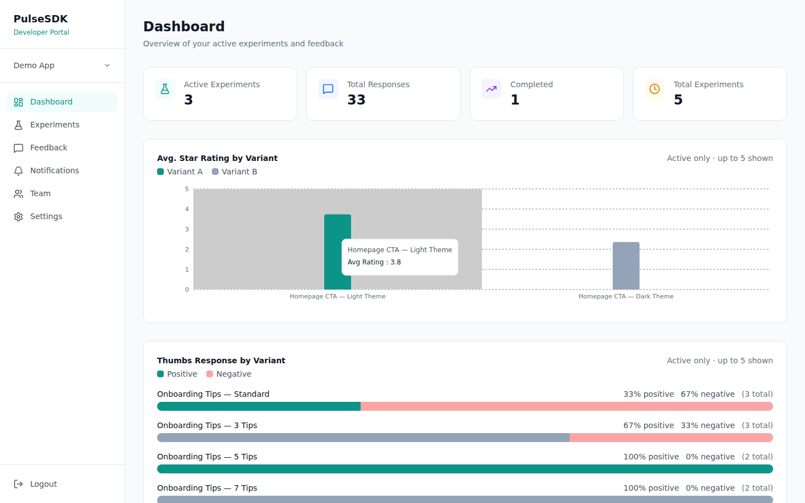
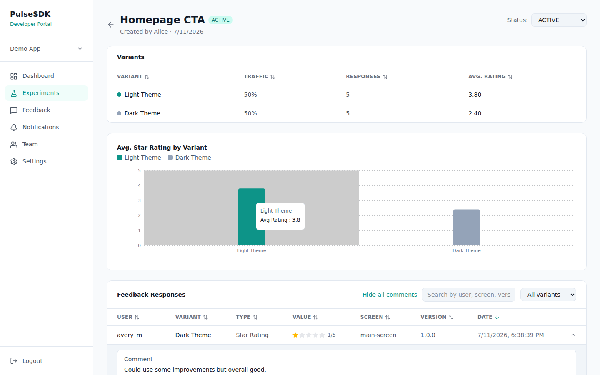
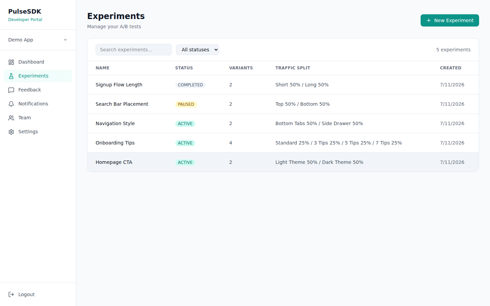
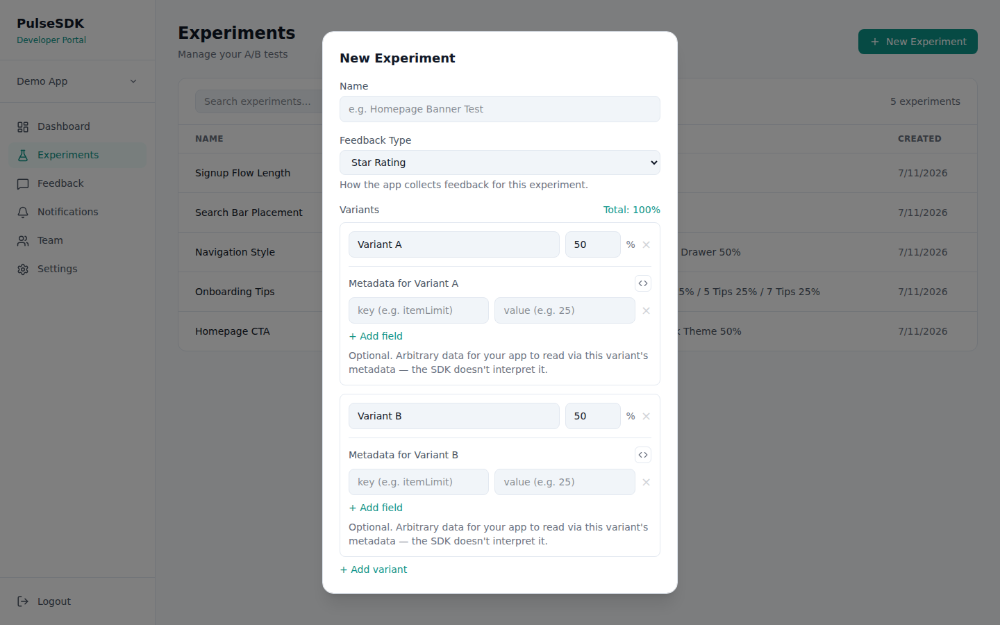
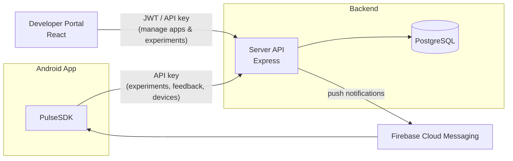

# PulseSDK

**In-app feedback and A/B testing for Android — one SDK, one dashboard.**

PulseSDK lets an Android team run experiments (different variants of a screen
or feature) and collect structured feedback (star ratings, thumbs up/down,
multiple choice, free text) from real users, then see the results live in a
web dashboard — without building any of that infrastructure themselves. A
developer drops the SDK into their app, defines experiments and feedback
prompts from the **Developer Portal**, and the SDK handles deterministic
variant assignment, offline-safe feedback queuing, and syncing everything
back to the server.

Full docs: **[pulsesdk docs site](https://daniel-varshavsky.github.io/pulsesdk/)**
(once GitHub Pages is enabled — see below) or browse [`docs/`](docs/) directly.
This README covers the essentials.

---

## Features

**Android SDK**
- Deterministic, per-user variant assignment (`getVariant`) — the same user
  always sees the same variant, no server round-trip needed after the first
  fetch
- Four feedback types out of the box: star rating, thumbs up/down, multiple
  choice, free text
- Offline-safe feedback queue (Room + WorkManager) — feedback submitted
  without a network connection uploads automatically once one's available
- User identity linking (`identify` / `clearUser`) for login/logout flows
- Push notification token registration via Firebase Cloud Messaging
- QA tooling: `overrideVariant` / `clearVariantOverride` to preview any
  variant without waiting on real assignment

**Developer Portal**
- Create and manage apps, invite collaborators by email
- Create experiments with weighted variants and per-variant metadata
- Live results per experiment: response counts, average star rating, thumbs
  breakdown, multiple-choice distribution — computed straight from the
  database, no batch jobs
- Send push notifications to an app's users
- Dashboard overview across all active experiments

**Server**
- REST API shared by the SDK and the Portal, with two auth modes: API key
  (SDK + read access) and JWT (Portal account actions)
- PostgreSQL + Prisma, server-side result aggregation (SQL `GROUP BY`/`AVG`,
  not pre-computed tables)

---

## Screenshots

| | |
|---|---|
|  |  |
| Dashboard — live overview across active experiments | Experiment detail — per-variant results and feedback |
|  |  |
| Experiments list | Creating an experiment |

## Demo Video

📺 *Video coming soon — link will go here.* A 90-second walkthrough covering
the architecture, creating an experiment in the Portal, calling the SDK from
Android, and watching results come back live.

---

## Architecture

A deliberately simple picture — three things talk to one database:



- The **SDK** never talks to the Portal directly — it only knows the server's
  API key-protected endpoints.
- The **Portal** uses a JWT for account actions (creating apps, inviting
  teammates, creating experiments) and the app's API key for anything the
  SDK could also do (reading results).
- The **server** is the only thing that touches the database — variant
  assignment weights, results aggregation, and notification fan-out all
  happen server-side.

---

## Implementation

| Component | Stack |
|---|---|
| Android SDK (`pulsesdk` module) | Kotlin, Retrofit, Room, WorkManager, Firebase Messaging |
| Demo app (`app` module) | Kotlin, Jetpack Compose-style views, consumes `pulsesdk` |
| Server | Node.js, Express, Prisma ORM, PostgreSQL |
| Portal | React 19, Vite, React Router, Tailwind, Recharts |

Variant assignment is a deterministic hash of `(userId, experimentId)` onto
the variants' cumulative weights — no server-side "is this user in group A or
B" storage is needed, which is also why the same user always lands in the
same variant. Feedback is queued locally (Room) and flushed by a
`WorkManager` job so a flaky connection never loses a response. On the
server, results and aggregates are computed live with SQL `GROUP BY`/`AVG`
queries at request time rather than a background job maintaining a
pre-computed table — simpler, and always correct.

---

## Using PulseSDK

### 1. Add the SDK to your Android app

```kotlin
// AndroidManifest.xml — auto-initializes on app start
<meta-data
    android:name="com.pulsesdk.API_KEY"
    android:value="YOUR_APP_API_KEY" />
```

```kotlin
// Or initialize manually
PulseSDK.init(context, apiKey = "YOUR_APP_API_KEY")

// Link the SDK to your own user after login
PulseSDK.identify(externalUserId = "user_123")
```

### 2. Assign a user to an experiment variant

```kotlin
val variant = PulseSDK.getVariant("Homepage CTA") ?: return
when (variant.variantName) {
    "Light Theme" -> applyLightTheme()
    "Dark Theme" -> applyDarkTheme()
}
```

### 3. Collect feedback

```kotlin
PulseSDK.submitStarRating(variant.variantId, rating = 5, comment = "Love it!")
PulseSDK.submitThumbs(variant.variantId, positive = true)
PulseSDK.submitMultipleChoice(variant.variantId, index = 2)
PulseSDK.submitText("Would love a dark mode toggle", screenId = "settings")
```

### 4. Manage everything from the Portal

Register at the Portal, create an app (this generates its API key), create
an experiment with variants, and watch responses arrive on the experiment's
detail page — no code beyond the SDK calls above.

Full setup instructions (Server + Portal local dev, Android Gradle setup):
see **[Get Started](docs/get-started.html)**.

---

## API reference (selected)

Full endpoint list and request/response shapes: see
**[API Reference](docs/api-reference.html)**.

| Method | Endpoint | Auth | Purpose |
|---|---|---|---|
| `POST` | `/devices/register` | API key | Register a device, get back a `userId` |
| `GET` | `/experiments` | API key | List active experiments (used by the SDK) |
| `POST` | `/feedback` | API key | Submit a feedback response |
| `GET` | `/experiments/:id/aggregate` | API key | Live per-variant results |
| `POST` | `/experiments` | JWT | Create an experiment (Portal) |
| `POST` | `/apps/:id/members` | JWT | Invite a collaborator by email |

**Example — submitting feedback:**

```http
POST /feedback
x-api-key: 172bc71f-1cc4-4192-ac26-44cf97981b7e
Content-Type: application/json

{
  "userId": "0e2e2b4e-06ea-4721-8111-afb9bb1c91cc",
  "variantId": "35ec81b3-7d76-46a1-ae25-3afa9d6e6332",
  "type": "STAR_RATING",
  "value": 5,
  "comment": "Great!",
  "screenId": "home",
  "appVersion": "1.0.0"
}
```

**Example — live aggregate response:**

```json
{
  "experimentId": "91884159-6bfc-46e6-b724-b3208d7e140e",
  "experimentName": "Homepage CTA",
  "aggregates": [
    {
      "variantId": "35ec81b3-7d76-46a1-ae25-3afa9d6e6332",
      "variantName": "Light Theme",
      "responseCount": 5,
      "starRating": { "avgRating": 3.8, "count": 5 }
    }
  ]
}
```

---

## Project layout

```
PulseSDK/
├── Android/
│   ├── pulsesdk/   # the SDK library module
│   └── app/        # demo app that consumes it
├── Server/         # Express + Prisma REST API
├── Portal/         # React developer dashboard
└── docs/           # full documentation site (GitHub Pages)
```

## Publishing the docs site

The `docs/` folder is a plain static site (no build step) — enable it in
**Settings → Pages → Source: Deploy from a branch → Branch: `main`, folder:
`/docs`**, then it's live at `https://<owner>.github.io/<repo>/`.

## License

Course project — no license specified.
